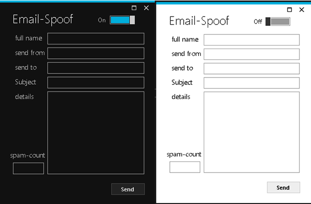

# Email-Spoof
 This was a side project I had while In school to spoof messages to my friends from any address I wanted(has to have an email format though a@b.c). They needed to be on the same domain, and I needed some permissions to access windows email services. 

#
### Themes

  

